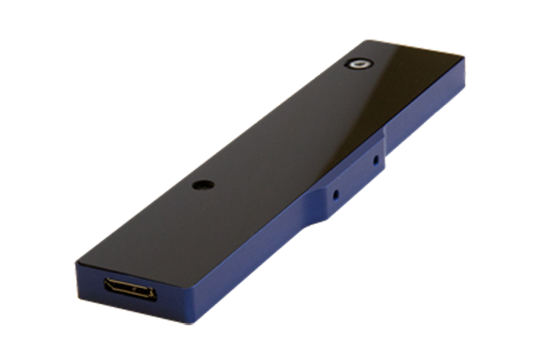
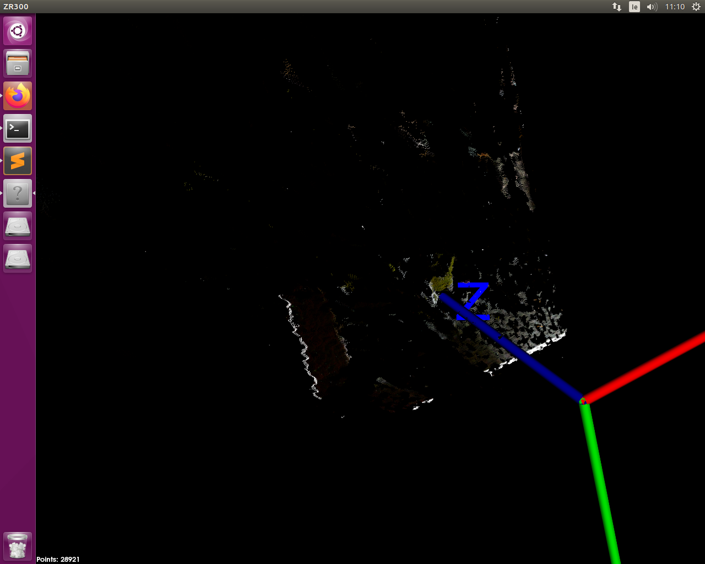

# zr300_pcl_visualizer
A simple pcl visualizer for the pointcloud of a ZR300 Intel Realsense camera

pcl - librealsense wrapper: https://joshmcculloch.nz/#!realsense

 
 

## How to compile IntelRealsense Legacy Library
Follow the instructions on: https://github.com/IntelRealSense/librealsense/tree/legacy or,

* Ubuntu 16.04.6 with kernel (4.15.0-69-generic)

      Dependencies:
      - sudo apt-get update
      - sudo apt-get install libssl-dev
      - sudo apt-get install libusb-1.0-0-dev pkg-config
      
       Relevant dependencies:
       - PCL 1.9.0 (You don't have to install it)
       - CMake >= 3.5     
      
      Library Build Process:
      
      - mkdir build && cd build
      - cmake ../
      - make (You don't have to install it)
      
      Video4Linux backend preparation:
      
      - sudo cp config/99-realsense-libusb.rules /etc/udev/rules.d/
      - sudo udevadm control --reload-rules && udevadm trigger
      
      At the root library folder, run:
      - ./scripts/patch-realsense-ubuntu-xenial.sh
      
   ## Test
      - Connect camera ZR300 to USB 3.0 port
      - cd /build
      - ./pcl-realsense
      
   ## Output example   
      There are 1 connected RealSense devices.

      Using device 0, an Intel RealSense ZR300
          Serial number: 4071801127
          Firmware version: 2.0.71.28

    
